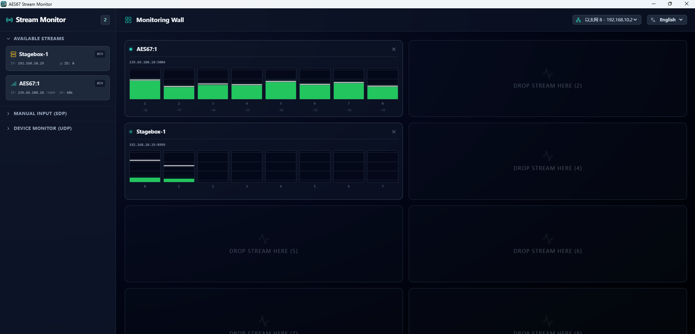

# AES67 AoIP Stream Monitor



A powerful, cross-platform audio level monitoring solution built with **Node** and **Electron**. This tool allows broadcast engineers and audio technicians to discover and monitor real-time audio levels of AES67 or ST2110-30 multicast streams through a GUI.

> **Acknowledgment**: This project references and builds upon logic from the [nicolassturmel/aes67-web-monitor](https://github.com/nicolassturmel/aes67-web-monitor) repository. Special thanks to **Nicolas**.

---

## 🌟 Key Features

* **Multi-Protocol Discovery**:
    * **SAP Auto-Discovery**: Automatically lists active multicast streams on the network.
    * **Manual SDP Input**: Support for manual stream entry via SDP text for devices without SAP.
    * **DIGISYNTHETIC AES67 Device Discovery + Output Monitoring**: Auto-listens on `239.0.0.188:9996`, builds analog/network output group cards, and polls output levels from device `ip:8999` only after drag-and-drop into slots.
* **Real-time Visualization**: High-precision **dBFs** meters for accurate signal quality judgment.
* **Drag-and-Drop Workflow**: Easily assign audio streams from the discovery list to a multi-screen monitoring wall.
* **Multilingual Interface**: Supports 8 languages (English, Chinese, Japanese, French, German, Korean, Spanish, and Italian).
* **Cross-Platform**: Compatible with Windows, macOS, and Linux.

---

## 🛠 Run Locally

**Prerequisites:**
* Node.js (LTS recommended)
* npm

### 1. Installation
```bash
# Clone the repository
git clone https://github.com/digisynthetic/aes67-stream-monitor.git
cd aes67-stream-monitor

# Install dependencies
npm i

# Start the application
npm run dev:app
```

# 📖 User Manual

## 1. Language Selection
Click the **Language Switch** button in the top right corner. The software supports: 
* English, Chinese, Japanese, French, German, Korean, Spanish, and Italian.

## 2. Network Interface Selection
Upon startup, select the **network interface card (NIC)** connected to your AoIP network from the menu in the top right corner. 
> **Note:** Once switched, the system will automatically refresh and start scanning for SAP/SDP broadcast data on that subnet.

---

## 3. Adding Audio Streams
* **SAP Discovery:** Streams found automatically will appear in the left-hand sidebar.
* **Manual SDP:** Paste the SDP text obtained from your source device to add streams manually.
* **Online AES67 Devices:** The app listens for device discovery packets on `239.0.0.188:9996`.
* Expand a device card to see child cards (max 8 channels per card):
  * Analog groups (red theme)
  * Network groups (green theme)
* Drag a child card to the right-side monitoring wall to start polling output levels (`getVolumeDbBatchOut`) from `device_ip:8999` at 3Hz.
* Device offline rules:
  * No discovery packet for 15s => related cards/meters turn gray.
  * No valid level JSON for 10s after monitoring starts => corresponding meter turns gray.

---

## 4. Monitoring Wall
1.  **Assign:** Left-click and hold a **Stream Card** from the sidebar.
2.  **Drag & Drop:** Drag it to any empty pane on the monitoring wall on the right.
3.  **Monitor:** The pane displays the real-time **Peak Level Meter**.
4.  **Remove:** Click the close (**X**) button in the top right corner of the pane to stop monitoring.

---

## 🔍 Troubleshooting

| Issue | Likely Cause | Solution |
| :--- | :--- | :--- |
| **Empty SAP List** | Wrong Network Interface | Check the Network Selection menu and verify the NIC. |
| **No Streams Found** | Firewall Blocking | Allow *AES67 Stream Monitor* through Windows Firewall (Private & Public). |
| **No Level Display** | IP/Subnet Mismatch | Ensure the PC and audio device are on the same subnet (try `ping`). |
| **No Level Display** | IGMP Configuration | Verify if the network switch has an **IGMP Querier** configured to handle multicast traffic. |

---

## 💻 System Support
* **Windows:** Supports Windows 11 and above.
* **macOS:** Supports latest macOS versions.
* **Linux:** Supports Ubuntu, Debian, etc.

---

## 🤝 Acknowledgments
This project utilizes logic and inspiration from:
* [aes67-web-monitor](https://github.com/nsturmel/aes67-web-monitor) - Created by **Nicolas Sturmel**.

## 📄 License
This project is licensed under the **MIT License**.
